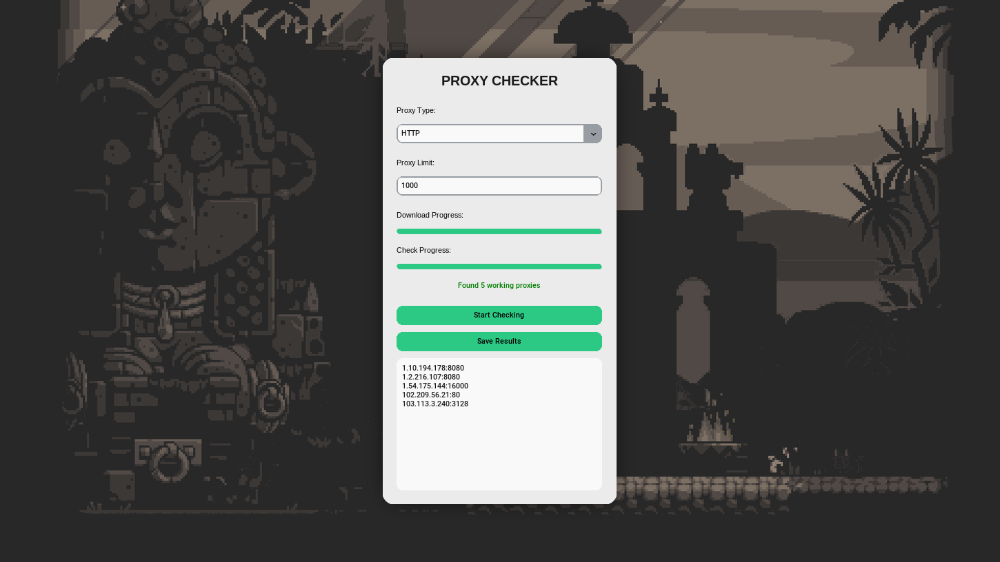
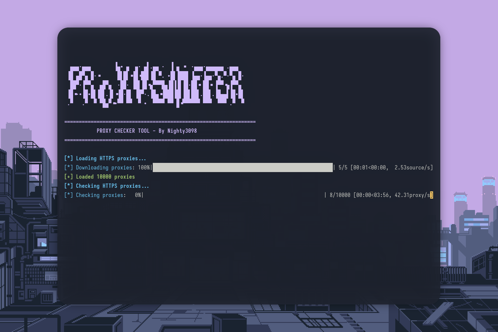

# ProxySniffer



This Python application downloads proxy lists from multiple sources by proxy type, checks their validity and outputs the list of working proxies. It supports HTTP, HTTPS, SOCKS4, and SOCKS5 proxy types.

## Features

- Loads proxy lists from predefined URLs for HTTP, HTTPS, SOCKS4, and SOCKS5.
- Checks proxy availability by making a test request through each proxy.
- Multithreaded proxy validation for faster processing.
- User selects proxy type and number of proxies to check.
- Outputs the list of working proxies.

## Install

```bash

git clone https://github.com/He4vyL0v3/ProxySniffer
cd ProxySniffer
pip3 install -r req.txt
cd src 
python3 main.py

```


